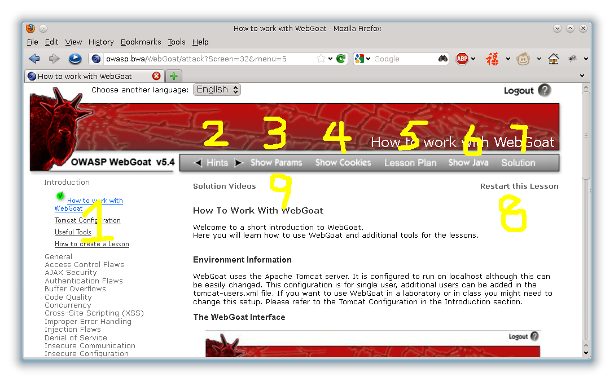

.. -*- coding: utf-8 -*-

.. _title :

如何利用WebGoat进行学习
========================

欢迎来到WebGoat的舞台。

这里你将会学习到如何使用WebGoat以及如何利用一些小工具完成课程。

.. _environ :

环境信息
---------

WebGoat使用Apache Tomcat服务器。
它被部署在本地运行。
默认的配置文件只适用于单人进行学习。
如果需要额外的用户，可以在 ``tomcat-user.xml`` 文件中添加新用户。
可以参考 `Tomcat配置`__ 部分。

__ Tomcat-Configuration.html

.. _interface :

WebGoat界面
------------

1. 这里是WebGoat给我们提供的课程。
2. 点击Hints可以给我们卡关带来提示。
3. 点击Show Params将会在页面显示HTTP请求参数（很有用哦，包括GET和POST参数）。
4. 点击Show Cookies将会在页面显示HTTP请求中的Cookies（同样非常有用）。
5. 点击Lesson Plan将会弹出相关课程的要求和目的。
6. 点击Show Java将会弹出相关java实现的源代码，这里是卡关的好线索查询地，也是学习知其然的地方（源代码前了无秘密）。
7. Solution将给你一种解决相关课程的方案。
8. 如果你希望重新学习已经完成的课程,点击这里将重新开始相关课程。
9. 就是国外大神做的视频教程啦。

.. _howto :

答题方法
---------

在学习相关课程时，请先浏览课程计划（Lesson Plan），然后尝试解答相关问题。
如有需要请积极利用提示（Hints）。
最后一个提示往往是解决该课程的一种方案。
如果通过提示还无法顺利回答课程问题的话，再去参考详细的解答（Solution）。（多思考，再看答案）

.. _param :

查看和修改参数
---------------

为了可以方便的查看和修改用户提交的HTTP参数，我们可以使用本地代理来截取HTTP请求。
（在WebGoat中我们可以很方便的从Show Params中查看，现实生活中没这样的好事情）
在课程中（解答方案）我们使用了WebScrarab。详情可以查看 `常用工具`__ 章节。

__ Useful-Tools.html

.. _cookies :

查看和修改Cookies
------------------
同样的，有时我们不仅需要修改用户提交的参数，还需要修改Cookies的值。同样我们使用WebScrarab来达到这一目的。
（同样在WebGoat我们可以使用Show Cookies来查看）

.. _last :

完成课程
---------
最后你会看到红色的 ``Congratulations`` 字样表示你已经完成了课程，左边的课程也会有一个绿色的勾，恭喜！

**欢迎来到WebGoat的世界！**
